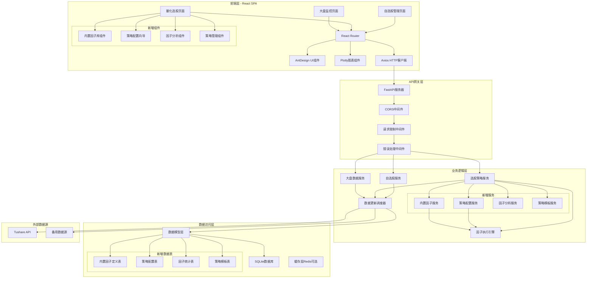

# 内置因子库及策略配置增强功能架构设计文档

## 概述

本文档描述了在现有量化选股系统基础上增加内置因子库和策略配置管理功能的完整技术架构设计。新功能将与现有系统无缝集成，通过提供20+常见技术指标和完整的策略配置管理，显著提升用户体验和系统易用性。

### 功能核心价值
- **即开即用**：内置MA、RSI、MACD等20+验证过的技术指标
- **策略复用**：完整的多因子策略配置保存和管理机制
- **新手友好**：配置向导和预设模板降低使用门槛
- **专业分析**：因子相关性分析和统计特征对比
- **灵活扩展**：支持复合因子创建和用户自定义因子贡献

## 架构

### 扩展后的系统架构图



### 技术栈增强

#### 后端新增依赖
- **TA-Lib**：技术指标计算库，提供标准化的指标实现
- **NumPy 1.24+**：数值计算，支持向量化操作
- **SciPy**：统计分析，用于因子相关性计算
- **Pandas 2.0+**：数据处理，支持高效的时间序列操作

#### 前端新增依赖
- **React DnD**：拖拽式因子配置界面
- **Recharts**：因子分析图表组件
- **React Hook Form**：复杂表单状态管理
- **Zustand**：轻量级状态管理（策略配置状态）

## 组件和接口

### 前端组件架构

#### 1. 内置因子库组件
```typescript
// 内置因子库主界面
interface BuiltinFactorLibraryProps {
  categories: FactorCategory[];
  onFactorSelect: (factor: BuiltinFactor) => void;
  onPreview: (factor: BuiltinFactor) => void;
}

// 因子分类标签
interface FactorCategoryTabsProps {
  categories: FactorCategory[];
  activeCategory: string;
  onCategoryChange: (category: string) => void;
}

// 因子卡片组件
interface FactorCardProps {
  factor: BuiltinFactor;
  onSelect: () => void;
  onPreview: () => void;
  onParameterConfig: (params: FactorParameters) => void;
}

// 因子预览弹窗
interface FactorPreviewModalProps {
  factor: BuiltinFactor;
  sampleData: FactorCalculationResult;
  isVisible: boolean;
  onClose: () => void;
}

// 因子参数配置
interface FactorParameterConfigProps {
  factor: BuiltinFactor;
  defaultParams: FactorParameters;
  onParamChange: (params: FactorParameters) => void;
  onValidate: (params: FactorParameters) => ValidationResult;
}
```

#### 2. 策略配置管理组件
```typescript
// 策略配置主界面
interface StrategyConfigurationProps {
  availableFactors: (CustomFactor | BuiltinFactor)[];
  existingStrategy?: SavedStrategy;
  onSave: (strategy: StrategyConfig) => void;
  onPreview: (strategy: StrategyConfig) => void;
}

// 权重配置组件
interface WeightConfigurationProps {
  factors: SelectedFactor[];
  onWeightChange: (factorId: string, weight: number) => void;
  onAutoBalance: () => void;
  onWeightPreset: (preset: WeightPreset) => void;
}

// 权重可视化图表
interface WeightVisualizationProps {
  weights: FactorWeight[];
  showPieChart?: boolean;
  showBarChart?: boolean;
  onWeightAdjust?: (factorId: string, newWeight: number) => void;
}

// 策略管理列表
interface StrategyManagementProps {
  strategies: SavedStrategy[];
  onLoad: (strategy: SavedStrategy) => void;
  onEdit: (strategy: SavedStrategy) => void;
  onDelete: (strategyId: string) => void;
  onExport: (strategy: SavedStrategy) => void;
  onImport: (strategyFile: File) => void;
}

// 策略执行历史
interface StrategyExecutionHistoryProps {
  executions: StrategyExecution[];
  onViewDetails: (execution: StrategyExecution) => void;
  onCompare: (executions: StrategyExecution[]) => void;
}
```

#### 3. 策略配置向导组件
```typescript
// 配置向导主组件
interface StrategyWizardProps {
  isVisible: boolean;
  onComplete: (strategy: StrategyConfig) => void;
  onCancel: () => void;
}

// 向导步骤组件
interface WizardStepProps {
  stepNumber: number;
  title: string;
  isActive: boolean;
  isCompleted: boolean;
  children: React.ReactNode;
}

// 策略模板选择
interface StrategyTemplateSelectionProps {
  templates: StrategyTemplate[];
  onSelect: (template: StrategyTemplate) => void;
  onSkip: () => void;
}

// 因子选择步骤
interface FactorSelectionStepProps {
  builtinFactors: BuiltinFactor[];
  customFactors: CustomFactor[];
  selectedFactors: SelectedFactor[];
  onFactorToggle: (factor: Factor) => void;
}

// 权重配置步骤
interface WeightConfigurationStepProps {
  selectedFactors: SelectedFactor[];
  onWeightChange: (factorId: string, weight: number) => void;
  onPresetApply: (preset: WeightPreset) => void;
}

// 策略预览步骤
interface StrategyPreviewStepProps {
  strategy: StrategyConfig;
  previewResult: StrategyPreviewResult;
  onModify: () => void;
  onConfirm: () => void;
}
```

#### 4. 因子分析组件
```typescript
// 因子分析主界面
interface FactorAnalysisProps {
  factors: Factor[];
  onAnalysisRun: (factors: Factor[], analysisType: AnalysisType) => void;
}

// 因子相关性矩阵
interface CorrelationMatrixProps {
  correlationData: CorrelationMatrix;
  factorNames: string[];
  onCellClick?: (factor1: string, factor2: string, correlation: number) => void;
}

// 因子统计特征对比
interface FactorStatisticsComparisonProps {
  factors: Factor[];
  statistics: FactorStatistics[];
  comparisonType: 'distribution' | 'stability' | 'effectiveness';
}

// 因子有效性分析
interface FactorEffectivenessProps {
  factor: Factor;
  effectivenessMetrics: EffectivenessMetrics;
  quantileAnalysis: QuantileAnalysis;
}
```

### API接口设计

#### 1. 内置因子库接口
```python
# 获取内置因子库
@router.get("/api/v1/builtin-factors")
async def get_builtin_factors(category: Optional[str] = None) -> List[BuiltinFactor]:
    """获取内置因子库列表，支持按分类筛选"""
    pass

# 获取因子详情
@router.get("/api/v1/builtin-factors/{factor_id}")
async def get_builtin_factor_detail(factor_id: str) -> BuiltinFactorDetail:
    """获取内置因子详细信息"""
    pass

# 预览因子计算结果
@router.post("/api/v1/builtin-factors/{factor_id}/preview")
async def preview_factor_calculation(
    factor_id: str, 
    params: FactorParameters,
    sample_stocks: List[str] = None
) -> FactorPreviewResult:
    """预览因子计算结果"""
    pass

# 验证因子参数
@router.post("/api/v1/builtin-factors/{factor_id}/validate-params")
async def validate_factor_parameters(
    factor_id: str,
    params: FactorParameters
) -> ValidationResult:
    """验证因子参数有效性"""
    pass

# 获取因子分类
@router.get("/api/v1/builtin-factors/categories")
async def get_factor_categories() -> List[FactorCategory]:
    """获取因子分类列表"""
    pass
```

#### 2. 策略配置管理接口
```python
# 策略配置CRUD
@router.post("/api/v1/strategy-configs")
async def create_strategy_config(config: CreateStrategyConfigRequest) -> SavedStrategy:
    """创建策略配置"""
    pass

@router.get("/api/v1/strategy-configs")
async def list_strategy_configs(
    page: int = 1,
    size: int = 20,
    search: Optional[str] = None
) -> PaginatedStrategies:
    """获取策略配置列表"""
    pass

@router.get("/api/v1/strategy-configs/{config_id}")
async def get_strategy_config(config_id: str) -> SavedStrategy:
    """获取策略配置详情"""
    pass

@router.put("/api/v1/strategy-configs/{config_id}")
async def update_strategy_config(
    config_id: str,
    config: UpdateStrategyConfigRequest
) -> SavedStrategy:
    """更新策略配置"""
    pass

@router.delete("/api/v1/strategy-configs/{config_id}")
async def delete_strategy_config(config_id: str) -> None:
    """删除策略配置"""
    pass

# 策略配置导入导出
@router.post("/api/v1/strategy-configs/import")
async def import_strategy_config(file: UploadFile) -> SavedStrategy:
    """导入策略配置"""
    pass

@router.get("/api/v1/strategy-configs/{config_id}/export")
async def export_strategy_config(config_id: str) -> FileResponse:
    """导出策略配置"""
    pass

# 批量操作
@router.post("/api/v1/strategy-configs/batch-delete")
async def batch_delete_strategy_configs(config_ids: List[str]) -> BatchOperationResult:
    """批量删除策略配置"""
    pass
```

#### 3. 策略模板和向导接口
```python
# 获取策略模板
@router.get("/api/v1/strategy-templates")
async def get_strategy_templates() -> List[StrategyTemplate]:
    """获取预设策略模板"""
    pass

# 获取模板详情
@router.get("/api/v1/strategy-templates/{template_id}")
async def get_strategy_template_detail(template_id: str) -> StrategyTemplateDetail:
    """获取策略模板详细信息"""
    pass

# 应用策略模板
@router.post("/api/v1/strategy-templates/{template_id}/apply")
async def apply_strategy_template(
    template_id: str,
    customizations: Optional[TemplateCustomizations] = None
) -> StrategyConfig:
    """应用策略模板生成配置"""
    pass

# 权重预设方案
@router.get("/api/v1/weight-presets")
async def get_weight_presets() -> List[WeightPreset]:
    """获取权重分配预设方案"""
    pass

# 权重优化建议
@router.post("/api/v1/strategies/optimize-weights")
async def optimize_strategy_weights(
    factors: List[SelectedFactor],
    optimization_method: OptimizationMethod = "equal_weight"
) -> WeightOptimizationResult:
    """获取权重优化建议"""
    pass

# 策略预览
@router.post("/api/v1/strategies/preview")
async def preview_strategy(config: StrategyConfig) -> StrategyPreviewResult:
    """预览策略配置效果"""
    pass
```

#### 4. 因子分析接口
```python
# 因子统计分析
@router.post("/api/v1/factors/statistics")
async def analyze_factor_statistics(
    factor_ids: List[str],
    analysis_type: StatisticsType = "all"
) -> FactorStatisticsResult:
    """分析因子统计特征"""
    pass

# 因子相关性分析
@router.post("/api/v1/factors/correlation")
async def analyze_factor_correlation(factor_ids: List[str]) -> CorrelationMatrix:
    """计算因子相关性矩阵"""
    pass

# 因子有效性分析
@router.post("/api/v1/factors/{factor_id}/effectiveness")
async def analyze_factor_effectiveness(
    factor_id: str,
    params: FactorParameters = None
) -> EffectivenessAnalysisResult:
    """分析因子有效性"""
    pass

# 因子对比分析
@router.post("/api/v1/factors/compare")
async def compare_factors(
    factor_ids: List[str],
    comparison_metrics: List[ComparisonMetric]
) -> FactorComparisonResult:
    """对比多个因子特征"""
    pass

# 获取因子计算历史
@router.get("/api/v1/factors/{factor_id}/calculation-history")
async def get_factor_calculation_history(
    factor_id: str,
    days: int = 30
) -> List[FactorCalculationRecord]:
    """获取因子计算历史"""
    pass
```

## 数据模型

### 数据库表结构扩展

#### 1. 内置因子定义表
```sql
CREATE TABLE builtin_factors (
    id VARCHAR(36) PRIMARY KEY,
    name VARCHAR(100) NOT NULL,
    display_name VARCHAR(100) NOT NULL,
    description TEXT,
    category VARCHAR(50) NOT NULL,
    calculation_method VARCHAR(50) NOT NULL, -- 'talib', 'custom', 'formula'
    formula TEXT, -- 计算公式或TA-Lib函数名
    default_parameters JSON,
    parameter_schema JSON, -- 参数验证schema
    input_fields JSON, -- 需要的输入字段 ['close', 'high', 'low', 'volume']
    output_type VARCHAR(20) DEFAULT 'single', -- 'single', 'multiple'
    is_active BOOLEAN DEFAULT TRUE,
    created_at TIMESTAMP DEFAULT CURRENT_TIMESTAMP,
    updated_at TIMESTAMP DEFAULT CURRENT_TIMESTAMP
);

-- 索引
CREATE INDEX idx_builtin_factors_category ON builtin_factors(category);
CREATE INDEX idx_builtin_factors_active ON builtin_factors(is_active);
```

#### 2. 策略配置表
```sql
CREATE TABLE strategy_configs (
    id VARCHAR(36) PRIMARY KEY,
    name VARCHAR(100) NOT NULL,
    description TEXT,
    factor_configs JSON NOT NULL, -- 因子配置数组
    weight_config JSON NOT NULL, -- 权重配置
    filters JSON, -- 筛选条件
    max_results INTEGER DEFAULT 100,
    created_by VARCHAR(50),
    created_at TIMESTAMP DEFAULT CURRENT_TIMESTAMP,
    updated_at TIMESTAMP DEFAULT CURRENT_TIMESTAMP,
    last_used_at TIMESTAMP,
    usage_count INTEGER DEFAULT 0,
    is_template BOOLEAN DEFAULT FALSE,
    tags VARCHAR(500) -- 标签，逗号分隔
);

-- 索引
CREATE INDEX idx_strategy_configs_created_by ON strategy_configs(created_by);
CREATE INDEX idx_strategy_configs_last_used ON strategy_configs(last_used_at DESC);
CREATE INDEX idx_strategy_configs_template ON strategy_configs(is_template);
```

#### 3. 因子统计分析表
```sql
CREATE TABLE factor_statistics (
    id INTEGER PRIMARY KEY AUTOINCREMENT,
    factor_id VARCHAR(36) NOT NULL,
    factor_type VARCHAR(20) NOT NULL, -- 'builtin', 'custom'
    analysis_date DATE NOT NULL,
    mean_value DECIMAL(15,6),
    std_deviation DECIMAL(15,6),
    min_value DECIMAL(15,6),
    max_value DECIMAL(15,6),
    quantile_25 DECIMAL(15,6),
    quantile_50 DECIMAL(15,6),
    quantile_75 DECIMAL(15,6),
    skewness DECIMAL(10,6),
    kurtosis DECIMAL(10,6),
    null_ratio DECIMAL(8,4),
    effectiveness_score DECIMAL(8,4),
    created_at TIMESTAMP DEFAULT CURRENT_TIMESTAMP,
    UNIQUE(factor_id, factor_type, analysis_date)
);

-- 索引
CREATE INDEX idx_factor_statistics_factor ON factor_statistics(factor_id, factor_type);
CREATE INDEX idx_factor_statistics_date ON factor_statistics(analysis_date DESC);
```

#### 4. 策略模板表
```sql
CREATE TABLE strategy_templates (
    id VARCHAR(36) PRIMARY KEY,
    name VARCHAR(100) NOT NULL,
    display_name VARCHAR(100) NOT NULL,
    description TEXT,
    category VARCHAR(50), -- 'value', 'growth', 'technical', 'momentum'
    factor_configs JSON NOT NULL,
    default_weights JSON NOT NULL,
    applicable_markets JSON, -- 适用市场
    risk_level VARCHAR(20), -- 'low', 'medium', 'high'
    expected_return_range VARCHAR(50),
    usage_scenarios TEXT,
    is_active BOOLEAN DEFAULT TRUE,
    created_at TIMESTAMP DEFAULT CURRENT_TIMESTAMP,
    updated_at TIMESTAMP DEFAULT CURRENT_TIMESTAMP
);

-- 索引
CREATE INDEX idx_strategy_templates_category ON strategy_templates(category);
CREATE INDEX idx_strategy_templates_active ON strategy_templates(is_active);
```

#### 5. 因子相关性表
```sql
CREATE TABLE factor_correlations (
    id INTEGER PRIMARY KEY AUTOINCREMENT,
    factor1_id VARCHAR(36) NOT NULL,
    factor1_type VARCHAR(20) NOT NULL,
    factor2_id VARCHAR(36) NOT NULL,
    factor2_type VARCHAR(20) NOT NULL,
    correlation_coefficient DECIMAL(8,6),
    p_value DECIMAL(10,8),
    analysis_date DATE NOT NULL,
    sample_size INTEGER,
    created_at TIMESTAMP DEFAULT CURRENT_TIMESTAMP,
    UNIQUE(factor1_id, factor1_type, factor2_id, factor2_type, analysis_date)
);

-- 索引
CREATE INDEX idx_factor_correlations_factor1 ON factor_correlations(factor1_id, factor1_type);
CREATE INDEX idx_factor_correlations_factor2 ON factor_correlations(factor2_id, factor2_type);
CREATE INDEX idx_factor_correlations_date ON factor_correlations(analysis_date DESC);
```

### Python数据模型类定义

#### 内置因子相关模型
```python
from pydantic import BaseModel, Field, validator
from typing import List, Optional, Dict, Any, Union
from datetime import datetime
from enum import Enum

class FactorCategory(str, Enum):
    TREND = "trend"           # 趋势类
    MOMENTUM = "momentum"     # 动量类  
    VOLUME = "volume"         # 价量类
    VOLATILITY = "volatility" # 波动率类
    VALUATION = "valuation"   # 估值类

class CalculationMethod(str, Enum):
    TALIB = "talib"          # 使用TA-Lib库
    CUSTOM = "custom"        # 自定义计算
    FORMULA = "formula"      # 公式计算

class FactorParameters(BaseModel):
    period: Optional[int] = Field(None, ge=1, le=252)
    fast_period: Optional[int] = Field(None, ge=1, le=100)
    slow_period: Optional[int] = Field(None, ge=1, le=100)
    signal_period: Optional[int] = Field(None, ge=1, le=50)
    multiplier: Optional[float] = Field(None, ge=0.1, le=10.0)
    custom_params: Dict[str, Any] = {}

class BuiltinFactor(BaseModel):
    id: str
    name: str
    display_name: str
    description: str
    category: FactorCategory
    calculation_method: CalculationMethod
    formula: Optional[str] = None
    default_parameters: FactorParameters
    parameter_schema: Dict[str, Any]
    input_fields: List[str]
    output_type: str = "single"
    is_active: bool = True
    created_at: datetime
    updated_at: datetime

class FactorPreviewResult(BaseModel):
    factor_id: str
    parameters: FactorParameters
    sample_data: List[Dict[str, float]]
    statistics: Dict[str, float]
    chart_data: List[Dict[str, Any]]
    calculation_time: float
```

#### 策略配置相关模型
```python
class WeightPresetType(str, Enum):
    EQUAL = "equal"                    # 等权重
    MARKET_CAP = "market_cap"         # 市值加权
    INVERSE_VOLATILITY = "inverse_vol" # 反波动率加权
    RISK_PARITY = "risk_parity"       # 风险平价
    CUSTOM = "custom"                  # 自定义

class SelectedFactor(BaseModel):
    factor_id: str
    factor_type: str  # 'builtin' or 'custom'
    factor_name: str
    parameters: FactorParameters
    weight: float = Field(ge=0.0, le=1.0)
    is_enabled: bool = True

class StrategyConfig(BaseModel):
    name: str
    description: Optional[str] = None
    factors: List[SelectedFactor]
    filters: Dict[str, Any] = {}
    max_results: int = Field(100, ge=1, le=1000)
    tags: List[str] = []
    
    @validator('factors')
    def validate_weights_sum(cls, v):
        total_weight = sum(f.weight for f in v if f.is_enabled)
        if not (0.99 <= total_weight <= 1.01):  # 允许1%的误差
            raise ValueError('因子权重总和必须等于100%')
        return v

class SavedStrategy(BaseModel):
    id: str
    name: str
    description: Optional[str] = None
    factor_configs: List[SelectedFactor]
    weight_config: Dict[str, float]
    filters: Dict[str, Any] = {}
    max_results: int
    created_by: Optional[str] = None
    created_at: datetime
    updated_at: datetime
    last_used_at: Optional[datetime] = None
    usage_count: int = 0
    tags: List[str] = []

class StrategyPreviewResult(BaseModel):
    config_summary: Dict[str, Any]
    factor_weights: List[Dict[str, Any]]
    estimated_results: Dict[str, int]
    risk_assessment: Dict[str, str]
    recommendations: List[str]
```

#### 策略模板相关模型
```python
class StrategyTemplateCategory(str, Enum):
    VALUE = "value"           # 价值投资
    GROWTH = "growth"         # 成长投资  
    TECHNICAL = "technical"   # 技术面
    MOMENTUM = "momentum"     # 动量策略
    QUALITY = "quality"       # 质量因子

class RiskLevel(str, Enum):
    LOW = "low"
    MEDIUM = "medium"
    HIGH = "high"

class StrategyTemplate(BaseModel):
    id: str
    name: str
    display_name: str
    description: str
    category: StrategyTemplateCategory
    factor_configs: List[Dict[str, Any]]
    default_weights: Dict[str, float]
    applicable_markets: List[str]
    risk_level: RiskLevel
    expected_return_range: str
    usage_scenarios: str
    is_active: bool = True
    created_at: datetime
    updated_at: datetime

class WeightPreset(BaseModel):
    id: str
    name: str
    description: str
    preset_type: WeightPresetType
    calculation_method: str
    is_default: bool = False
```

#### 因子分析相关模型
```python
class FactorStatistics(BaseModel):
    factor_id: str
    factor_type: str
    analysis_date: datetime
    mean_value: float
    std_deviation: float
    min_value: float
    max_value: float
    quantile_25: float
    quantile_50: float
    quantile_75: float
    skewness: float
    kurtosis: float
    null_ratio: float
    effectiveness_score: float

class CorrelationMatrix(BaseModel):
    factor_ids: List[str]
    factor_names: List[str]
    correlation_matrix: List[List[float]]
    p_value_matrix: List[List[float]]
    analysis_date: datetime
    sample_size: int

class EffectivenessMetrics(BaseModel):
    factor_id: str
    discriminative_power: float  # 区分度
    stability_score: float       # 稳定性得分
    information_ratio: float     # 信息比率
    quantile_spread: float       # 分位数间差异
    monotonicity: float          # 单调性得分

class QuantileAnalysisResult(BaseModel):
    quantile_groups: List[Dict[str, Any]]
    performance_metrics: Dict[str, List[float]]
    statistical_significance: Dict[str, float]
```

## 内置因子库实现方案

### 因子分类和实现

#### 1. 趋势类因子 (Trend Factors)
```python
class TrendFactors:
    """趋势类技术指标实现"""
    
    @staticmethod 
    def moving_average(data: pd.Series, period: int = 20) -> pd.Series:
        """简单移动平均线"""
        return data.rolling(window=period).mean()
    
    @staticmethod
    def exponential_moving_average(data: pd.Series, period: int = 20) -> pd.Series:
        """指数移动平均线"""
        return data.ewm(span=period, adjust=False).mean()
    
    @staticmethod
    def bollinger_bands(data: pd.Series, period: int = 20, std_dev: float = 2.0) -> Dict[str, pd.Series]:
        """布林带"""
        sma = data.rolling(window=period).mean()
        std = data.rolling(window=period).std()
        return {
            'upper': sma + (std * std_dev),
            'middle': sma,
            'lower': sma - (std * std_dev)
        }
    
    @staticmethod
    def ma_crossover_signal(short_ma: pd.Series, long_ma: pd.Series) -> pd.Series:
        """移动平均线交叉信号"""
        return (short_ma > long_ma).astype(int)
```

#### 2. 动量类因子 (Momentum Factors)  
```python
class MomentumFactors:
    """动量类技术指标实现"""
    
    @staticmethod
    def rsi(data: pd.Series, period: int = 14) -> pd.Series:
        """相对强弱指数"""
        delta = data.diff()
        gain = (delta.where(delta > 0, 0)).rolling(window=period).mean()
        loss = (-delta.where(delta < 0, 0)).rolling(window=period).mean()
        rs = gain / loss
        return 100 - (100 / (1 + rs))
    
    @staticmethod
    def macd(data: pd.Series, fast: int = 12, slow: int = 26, signal: int = 9) -> Dict[str, pd.Series]:
        """MACD指标"""
        ema_fast = data.ewm(span=fast).mean()
        ema_slow = data.ewm(span=slow).mean()
        macd_line = ema_fast - ema_slow
        signal_line = macd_line.ewm(span=signal).mean()
        histogram = macd_line - signal_line
        return {
            'macd': macd_line,
            'signal': signal_line,
            'histogram': histogram
        }
    
    @staticmethod
    def stochastic_oscillator(high: pd.Series, low: pd.Series, close: pd.Series, 
                            k_period: int = 14, d_period: int = 3) -> Dict[str, pd.Series]:
        """随机振荡器"""
        lowest_low = low.rolling(window=k_period).min()
        highest_high = high.rolling(window=k_period).max()
        k_percent = 100 * ((close - lowest_low) / (highest_high - lowest_low))
        d_percent = k_percent.rolling(window=d_period).mean()
        return {'%K': k_percent, '%D': d_percent}
```

#### 3. 价量类因子 (Volume Factors)
```python
class VolumeFactors:
    """价量类技术指标实现"""
    
    @staticmethod
    def volume_price_trend(close: pd.Series, volume: pd.Series) -> pd.Series:
        """量价趋势指标"""
        price_change = close.pct_change()
        return (price_change * volume).cumsum()
    
    @staticmethod
    def on_balance_volume(close: pd.Series, volume: pd.Series) -> pd.Series:
        """平衡成交量"""
        price_change = close.diff()
        volume_direction = volume.where(price_change > 0, 
                                      -volume.where(price_change < 0, 0))
        return volume_direction.cumsum()
    
    @staticmethod
    def money_flow_index(high: pd.Series, low: pd.Series, close: pd.Series, 
                        volume: pd.Series, period: int = 14) -> pd.Series:
        """资金流量指数"""
        typical_price = (high + low + close) / 3
        money_flow = typical_price * volume
        
        positive_flow = money_flow.where(typical_price.diff() > 0, 0).rolling(period).sum()
        negative_flow = money_flow.where(typical_price.diff() < 0, 0).rolling(period).sum().abs()
        
        money_ratio = positive_flow / negative_flow
        return 100 - (100 / (1 + money_ratio))
```

### 因子计算引擎集成

```python
class BuiltinFactorCalculator:
    """内置因子计算引擎"""
    
    def __init__(self):
        self.factor_registry = self._build_factor_registry()
    
    def _build_factor_registry(self) -> Dict[str, Any]:
        """构建因子注册表"""
        return {
            # 趋势类
            'sma': {'class': TrendFactors, 'method': 'moving_average', 'params': ['period']},
            'ema': {'class': TrendFactors, 'method': 'exponential_moving_average', 'params': ['period']},
            'bollinger': {'class': TrendFactors, 'method': 'bollinger_bands', 'params': ['period', 'std_dev']},
            
            # 动量类
            'rsi': {'class': MomentumFactors, 'method': 'rsi', 'params': ['period']},
            'macd': {'class': MomentumFactors, 'method': 'macd', 'params': ['fast', 'slow', 'signal']},
            'stoch': {'class': MomentumFactors, 'method': 'stochastic_oscillator', 'params': ['k_period', 'd_period']},
            
            # 价量类
            'vpt': {'class': VolumeFactors, 'method': 'volume_price_trend', 'params': []},
            'obv': {'class': VolumeFactors, 'method': 'on_balance_volume', 'params': []},
            'mfi': {'class': VolumeFactors, 'method': 'money_flow_index', 'params': ['period']},
        }
    
    async def calculate_factor(self, factor_id: str, data: pd.DataFrame, 
                             parameters: FactorParameters) -> pd.Series:
        """计算指定因子"""
        if factor_id not in self.factor_registry:
            raise ValueError(f"未知的内置因子: {factor_id}")
        
        factor_config = self.factor_registry[factor_id]
        factor_class = factor_config['class']
        method_name = factor_config['method']
        
        # 准备参数
        method_params = self._prepare_method_params(factor_config, parameters, data)
        
        # 调用计算方法
        method = getattr(factor_class, method_name)
        result = method(**method_params)
        
        return result
    
    def _prepare_method_params(self, factor_config: Dict, parameters: FactorParameters, 
                             data: pd.DataFrame) -> Dict[str, Any]:
        """准备方法调用参数"""
        params = {}
        
        # 添加数据参数
        if 'close' in data.columns:
            params['data'] = data['close']
        if 'high' in data.columns:
            params['high'] = data['high']
        if 'low' in data.columns:
            params['low'] = data['low']
        if 'volume' in data.columns:
            params['volume'] = data['volume']
        
        # 添加用户参数
        param_mapping = {
            'period': parameters.period,
            'fast': parameters.fast_period,
            'slow': parameters.slow_period,
            'signal': parameters.signal_period,
            'std_dev': parameters.multiplier,
            'k_period': parameters.period,
            'd_period': parameters.signal_period,
        }
        
        for param_name in factor_config['params']:
            if param_name in param_mapping and param_mapping[param_name] is not None:
                params[param_name] = param_mapping[param_name]
        
        return params
```

## 错误处理

### 新增错误类型
```python
class ErrorCode(str, Enum):
    # 现有错误代码...
    
    # 内置因子相关错误
    BUILTIN_FACTOR_NOT_FOUND = "BUILTIN_FACTOR_NOT_FOUND"
    FACTOR_PARAMETER_INVALID = "FACTOR_PARAMETER_INVALID"
    FACTOR_CALCULATION_FAILED = "FACTOR_CALCULATION_FAILED"
    
    # 策略配置相关错误
    STRATEGY_CONFIG_INVALID = "STRATEGY_CONFIG_INVALID"
    STRATEGY_WEIGHT_INVALID = "STRATEGY_WEIGHT_INVALID"
    STRATEGY_NOT_FOUND = "STRATEGY_NOT_FOUND"
    STRATEGY_IMPORT_FAILED = "STRATEGY_IMPORT_FAILED"
    
    # 因子分析相关错误
    FACTOR_ANALYSIS_FAILED = "FACTOR_ANALYSIS_FAILED"
    CORRELATION_CALCULATION_FAILED = "CORRELATION_CALCULATION_FAILED"
    INSUFFICIENT_DATA = "INSUFFICIENT_DATA"
```

### 错误处理服务
```python
class BuiltinFactorErrorHandler:
    """内置因子错误处理"""
    
    @staticmethod
    def handle_calculation_error(factor_id: str, error: Exception) -> APIError:
        """处理因子计算错误"""
        if isinstance(error, ValueError):
            return APIError(
                ErrorCode.FACTOR_PARAMETER_INVALID,
                f"因子 {factor_id} 参数无效: {str(error)}"
            )
        elif isinstance(error, KeyError):
            return APIError(
                ErrorCode.BUILTIN_FACTOR_NOT_FOUND,
                f"内置因子 {factor_id} 不存在"
            )
        else:
            return APIError(
                ErrorCode.FACTOR_CALCULATION_FAILED,
                f"因子 {factor_id} 计算失败: {str(error)}"
            )
    
    @staticmethod 
    def handle_strategy_config_error(error: Exception) -> APIError:
        """处理策略配置错误"""
        if "权重" in str(error):
            return APIError(
                ErrorCode.STRATEGY_WEIGHT_INVALID,
                f"策略权重配置错误: {str(error)}"
            )
        else:
            return APIError(
                ErrorCode.STRATEGY_CONFIG_INVALID,
                f"策略配置错误: {str(error)}"
            )
```

## 性能优化

### 因子计算缓存策略
```python
class FactorCalculationCache:
    """因子计算结果缓存"""
    
    def __init__(self, redis_client=None):
        self.redis_client = redis_client
        self.memory_cache = {}
        self.cache_ttl = 3600  # 1小时
    
    def get_cache_key(self, factor_id: str, parameters: FactorParameters, 
                     data_hash: str) -> str:
        """生成缓存键"""
        param_str = json.dumps(parameters.dict(), sort_keys=True)
        param_hash = hashlib.md5(param_str.encode()).hexdigest()
        return f"factor:{factor_id}:{param_hash}:{data_hash}"
    
    async def get_cached_result(self, cache_key: str) -> Optional[pd.Series]:
        """获取缓存结果"""
        if self.redis_client:
            cached_data = await self.redis_client.get(cache_key)
            if cached_data:
                return pd.read_json(cached_data, typ='series')
        
        return self.memory_cache.get(cache_key)
    
    async def set_cached_result(self, cache_key: str, result: pd.Series):
        """设置缓存结果"""
        if self.redis_client:
            await self.redis_client.setex(
                cache_key, 
                self.cache_ttl, 
                result.to_json()
            )
        
        self.memory_cache[cache_key] = result
        
        # 内存缓存大小控制
        if len(self.memory_cache) > 100:
            oldest_key = next(iter(self.memory_cache))
            del self.memory_cache[oldest_key]
```

### 批量计算优化
```python
class BatchFactorCalculator:
    """批量因子计算优化"""
    
    async def calculate_multiple_factors(self, factor_configs: List[Dict], 
                                       data: pd.DataFrame) -> Dict[str, pd.Series]:
        """并行计算多个因子"""
        tasks = []
        for config in factor_configs:
            task = self.calculate_single_factor(
                config['factor_id'],
                data,
                config['parameters']
            )
            tasks.append(task)
        
        results = await asyncio.gather(*tasks, return_exceptions=True)
        
        factor_results = {}
        for i, result in enumerate(results):
            factor_id = factor_configs[i]['factor_id']
            if isinstance(result, Exception):
                logging.error(f"因子 {factor_id} 计算失败: {result}")
                factor_results[factor_id] = None
            else:
                factor_results[factor_id] = result
                
        return factor_results
```

这个架构设计提供了完整的内置因子库和策略配置管理解决方案，包含了20+技术指标、完整的权重配置、策略保存复用、因子分析对比等核心功能。设计充分考虑了性能优化、错误处理和扩展性，与现有系统无缝集成。

设计方案看起来可行吗？如果认可的话，我们可以开始拆解具体任务了！