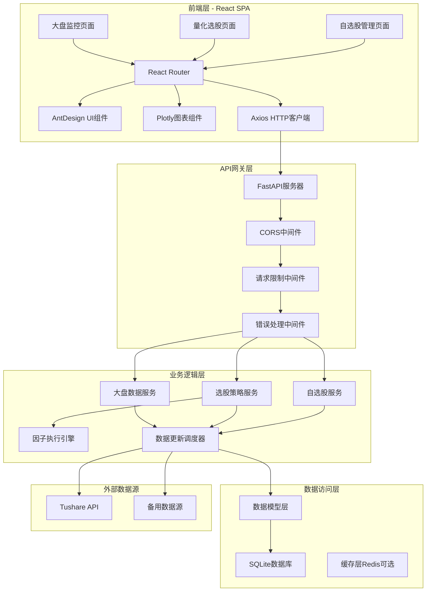

# 量化主观选股系统架构设计文档

## 概述

本文档描述了量化主观选股系统的完整技术架构设计。系统采用前后端分离架构，前端使用React + AntDesign构建现代化管理后台，后端使用Python + FastAPI提供高性能API服务，数据存储采用SQLite确保轻量级部署和高效查询。

### 系统核心价值
- **数据驱动决策**：基于Tushare提供的实时和历史数据进行量化分析
- **个性化策略**：支持用户自定义Python因子代码，实现个性化选股策略
- **实时监控**：提供大盘指数和自选股的实时价格监控
- **交互式可视化**：使用Plotly提供专业级金融图表展示

## 架构

### 系统架构图



### 技术栈选择

#### 前端技术栈
- **React 18.x**：现代化UI框架，支持Hooks和并发特性
- **AntDesign 5.x**：企业级UI组件库，提供丰富的表格、表单、布局组件
- **Plotly.js + react-plotly.js**：专业金融图表库，支持K线图、技术指标
- **Axios**：HTTP客户端，支持请求拦截、响应处理
- **React Router 6.x**：单页应用路由管理
- **dayjs**：轻量级日期处理库

#### 后端技术栈
- **Python 3.9+**：主要开发语言
- **FastAPI**：现代高性能Web框架，自动生成API文档
- **SQLAlchemy 2.x**：ORM框架，支持异步操作
- **Pydantic**：数据验证和序列化
- **Tushare**：金融数据接口
- **APScheduler**：任务调度框架
- **RestrictedPython**：安全的Python代码执行环境

#### 数据存储
- **SQLite**：轻量级关系数据库，支持并发读写
- **Redis（可选）**：缓存层，提升高频查询性能

## 组件和接口

### 前端组件架构

#### 1. 布局组件
```typescript
// 主布局组件
interface MainLayoutProps {
  children: React.ReactNode;
}

// 侧边栏导航
interface SidebarProps {
  selectedKey: string;
  onMenuSelect: (key: string) => void;
}

// 顶部状态栏
interface HeaderProps {
  marketStatus: 'open' | 'closed' | 'pre-market' | 'after-hours';
  lastUpdate: Date;
}
```

#### 2. 大盘监控组件
```typescript
// 大盘监控主页面
interface MarketDashboardProps {
  indices: MarketIndex[];
  watchlist: Stock[];
  onAddToWatchlist: (stock: Stock) => void;
}

// 指数卡片组件
interface IndexCardProps {
  index: MarketIndex;
  showChart?: boolean;
}

// 实时价格组件
interface RealTimePriceProps {
  symbol: string;
  price: number;
  change: number;
  changePercent: number;
  volume: number;
}
```

#### 3. 量化选股组件
```typescript
// 因子管理页面
interface FactorManagementProps {
  factors: Factor[];
  onCreateFactor: (factor: CreateFactorRequest) => void;
  onEditFactor: (id: string, factor: UpdateFactorRequest) => void;
  onDeleteFactor: (id: string) => void;
}

// 因子编辑器
interface FactorEditorProps {
  factor?: Factor;
  onSave: (code: string, metadata: FactorMetadata) => void;
  onTest: (code: string) => void;
}

// 策略配置组件
interface StrategyConfigProps {
  availableFactors: Factor[];
  onRunStrategy: (config: StrategyConfig) => void;
}

// 选股结果展示
interface SelectionResultsProps {
  results: StockScore[];
  onAddToWatchlist: (stocks: Stock[]) => void;
}
```

#### 4. 图表组件
```typescript
// K线图组件
interface CandlestickChartProps {
  symbol: string;
  data: OHLCV[];
  indicators?: TechnicalIndicator[];
  timeframe: '1m' | '5m' | '15m' | '1h' | '1d';
}

// 技术指标图表
interface IndicatorChartProps {
  data: IndicatorData[];
  type: 'line' | 'bar' | 'area';
  yAxis?: 'left' | 'right';
}
```

### API接口设计

#### 1. 大盘数据接口
```python
# 获取主要指数数据
@router.get("/api/v1/market/indices")
async def get_market_indices() -> List[MarketIndex]:
    """获取主要市场指数的实时数据"""
    pass

# 获取指数历史数据
@router.get("/api/v1/market/indices/{symbol}/history")
async def get_index_history(
    symbol: str,
    start_date: date,
    end_date: date,
    interval: str = "1d"
) -> List[OHLCV]:
    """获取指数历史OHLCV数据"""
    pass

# 获取股票实时价格
@router.get("/api/v1/market/stocks/{symbol}/quote")
async def get_stock_quote(symbol: str) -> StockQuote:
    """获取股票实时报价"""
    pass
```

#### 2. 量化选股接口
```python
# 因子管理
@router.post("/api/v1/factors")
async def create_factor(factor: CreateFactorRequest) -> Factor:
    """创建新的选股因子"""
    pass

@router.get("/api/v1/factors")
async def list_factors() -> List[Factor]:
    """获取所有因子列表"""
    pass

@router.put("/api/v1/factors/{factor_id}")
async def update_factor(factor_id: str, factor: UpdateFactorRequest) -> Factor:
    """更新因子信息"""
    pass

@router.delete("/api/v1/factors/{factor_id}")
async def delete_factor(factor_id: str) -> None:
    """删除因子"""
    pass

# 因子测试
@router.post("/api/v1/factors/test")
async def test_factor(request: TestFactorRequest) -> TestResult:
    """测试因子代码的有效性"""
    pass

# 策略执行
@router.post("/api/v1/strategies/run")
async def run_strategy(config: StrategyConfig) -> StrategyResult:
    """执行选股策略"""
    pass

# 获取策略历史
@router.get("/api/v1/strategies/history")
async def get_strategy_history() -> List[StrategyExecution]:
    """获取策略执行历史"""
    pass
```

#### 3. 自选股管理接口
```python
# 自选股CRUD
@router.get("/api/v1/watchlist")
async def get_watchlist() -> List[WatchlistItem]:
    """获取自选股列表"""
    pass

@router.post("/api/v1/watchlist")
async def add_to_watchlist(request: AddWatchlistRequest) -> WatchlistItem:
    """添加股票到自选股"""
    pass

@router.delete("/api/v1/watchlist/{symbol}")
async def remove_from_watchlist(symbol: str) -> None:
    """从自选股中移除股票"""
    pass

# 自选股批量操作
@router.post("/api/v1/watchlist/batch")
async def batch_add_watchlist(request: BatchAddWatchlistRequest) -> List[WatchlistItem]:
    """批量添加自选股"""
    pass
```

#### 4. 数据管理接口
```python
# 数据更新状态
@router.get("/api/v1/data/status")
async def get_data_status() -> DataStatus:
    """获取数据更新状态"""
    pass

# 手动触发数据更新
@router.post("/api/v1/data/refresh")
async def refresh_data(request: RefreshDataRequest) -> RefreshResult:
    """手动触发数据刷新"""
    pass

# 获取股票基本信息
@router.get("/api/v1/stocks/search")
async def search_stocks(query: str, limit: int = 20) -> List[StockInfo]:
    """搜索股票"""
    pass
```

## 数据模型

### 数据库表结构

#### 1. 股票基础信息表
```sql
CREATE TABLE stocks (
    symbol VARCHAR(20) PRIMARY KEY,
    name VARCHAR(100) NOT NULL,
    industry VARCHAR(50),
    sector VARCHAR(50),
    market VARCHAR(20),
    list_date DATE,
    is_active BOOLEAN DEFAULT TRUE,
    created_at TIMESTAMP DEFAULT CURRENT_TIMESTAMP,
    updated_at TIMESTAMP DEFAULT CURRENT_TIMESTAMP
);

-- 索引优化
CREATE INDEX idx_stocks_industry ON stocks(industry);
CREATE INDEX idx_stocks_sector ON stocks(sector);
CREATE INDEX idx_stocks_market ON stocks(market);
```

#### 2. 市场数据表
```sql
CREATE TABLE market_data (
    id INTEGER PRIMARY KEY AUTOINCREMENT,
    symbol VARCHAR(20) NOT NULL,
    trade_date DATE NOT NULL,
    open_price DECIMAL(10,2),
    high_price DECIMAL(10,2),
    low_price DECIMAL(10,2),
    close_price DECIMAL(10,2),
    volume BIGINT,
    amount DECIMAL(15,2),
    turnover_rate DECIMAL(8,4),
    created_at TIMESTAMP DEFAULT CURRENT_TIMESTAMP,
    UNIQUE(symbol, trade_date)
);

-- 关键索引：symbol和trade_date的组合索引用于快速查询
CREATE INDEX idx_market_data_symbol_date ON market_data(symbol, trade_date DESC);
CREATE INDEX idx_market_data_date ON market_data(trade_date DESC);
```

#### 3. 实时行情表
```sql
CREATE TABLE real_time_quotes (
    symbol VARCHAR(20) PRIMARY KEY,
    current_price DECIMAL(10,2),
    change_amount DECIMAL(10,2),
    change_percent DECIMAL(8,4),
    volume BIGINT,
    amount DECIMAL(15,2),
    bid_price DECIMAL(10,2),
    ask_price DECIMAL(10,2),
    high_price DECIMAL(10,2),
    low_price DECIMAL(10,2),
    open_price DECIMAL(10,2),
    pre_close DECIMAL(10,2),
    updated_at TIMESTAMP DEFAULT CURRENT_TIMESTAMP
);

-- 实时数据按更新时间索引
CREATE INDEX idx_quotes_updated_at ON real_time_quotes(updated_at DESC);
```

#### 4. 因子定义表
```sql
CREATE TABLE factors (
    id VARCHAR(36) PRIMARY KEY,
    name VARCHAR(100) NOT NULL,
    description TEXT,
    code TEXT NOT NULL,
    parameters JSON,
    category VARCHAR(50),
    created_by VARCHAR(50),
    created_at TIMESTAMP DEFAULT CURRENT_TIMESTAMP,
    updated_at TIMESTAMP DEFAULT CURRENT_TIMESTAMP,
    is_active BOOLEAN DEFAULT TRUE
);

CREATE INDEX idx_factors_category ON factors(category);
CREATE INDEX idx_factors_created_by ON factors(created_by);
```

#### 5. 策略执行记录表
```sql
CREATE TABLE strategy_executions (
    id VARCHAR(36) PRIMARY KEY,
    name VARCHAR(100),
    factor_configs JSON NOT NULL,
    execution_time TIMESTAMP DEFAULT CURRENT_TIMESTAMP,
    total_stocks INTEGER,
    selected_stocks INTEGER,
    execution_duration INTEGER,
    status VARCHAR(20) DEFAULT 'completed',
    error_message TEXT
);

CREATE INDEX idx_strategy_executions_time ON strategy_executions(execution_time DESC);
CREATE INDEX idx_strategy_executions_status ON strategy_executions(status);
```

#### 6. 选股结果表
```sql
CREATE TABLE selection_results (
    id INTEGER PRIMARY KEY AUTOINCREMENT,
    execution_id VARCHAR(36) NOT NULL,
    symbol VARCHAR(20) NOT NULL,
    total_score DECIMAL(10,6),
    factor_scores JSON,
    rank_position INTEGER,
    created_at TIMESTAMP DEFAULT CURRENT_TIMESTAMP,
    FOREIGN KEY (execution_id) REFERENCES strategy_executions(id),
    FOREIGN KEY (symbol) REFERENCES stocks(symbol)
);

-- 复合索引用于快速查询特定执行的结果
CREATE INDEX idx_selection_results_execution ON selection_results(execution_id, rank_position);
CREATE INDEX idx_selection_results_symbol ON selection_results(symbol, created_at DESC);
```

#### 7. 自选股表
```sql
CREATE TABLE watchlist (
    id INTEGER PRIMARY KEY AUTOINCREMENT,
    symbol VARCHAR(20) NOT NULL,
    added_at TIMESTAMP DEFAULT CURRENT_TIMESTAMP,
    notes TEXT,
    tags VARCHAR(200),
    UNIQUE(symbol)
);

CREATE INDEX idx_watchlist_added_at ON watchlist(added_at DESC);
```

### 数据模型类定义

#### Python Pydantic模型
```python
from pydantic import BaseModel, Field
from typing import List, Optional, Dict, Any
from datetime import date, datetime
from decimal import Decimal

class StockInfo(BaseModel):
    symbol: str
    name: str
    industry: Optional[str] = None
    sector: Optional[str] = None
    market: str
    list_date: Optional[date] = None
    is_active: bool = True

class OHLCV(BaseModel):
    symbol: str
    trade_date: date
    open_price: Decimal
    high_price: Decimal
    low_price: Decimal
    close_price: Decimal
    volume: int
    amount: Decimal
    turnover_rate: Optional[Decimal] = None

class StockQuote(BaseModel):
    symbol: str
    current_price: Decimal
    change_amount: Decimal
    change_percent: Decimal
    volume: int
    amount: Decimal
    high_price: Decimal
    low_price: Decimal
    open_price: Decimal
    pre_close: Decimal
    updated_at: datetime

class Factor(BaseModel):
    id: str
    name: str
    description: Optional[str] = None
    code: str
    parameters: Dict[str, Any] = {}
    category: Optional[str] = None
    created_by: Optional[str] = None
    created_at: datetime
    updated_at: datetime
    is_active: bool = True

class StrategyConfig(BaseModel):
    name: str
    factors: List[Dict[str, Any]]  # factor_id, weight, parameters
    filters: Dict[str, Any] = {}
    max_results: int = 100

class StockScore(BaseModel):
    symbol: str
    name: str
    total_score: Decimal
    factor_scores: Dict[str, Decimal]
    rank_position: int
    current_price: Optional[Decimal] = None
    change_percent: Optional[Decimal] = None
```

## 错误处理

### 错误分类和处理策略

#### 1. API错误处理
```python
from fastapi import HTTPException, status
from enum import Enum

class ErrorCode(str, Enum):
    # 数据相关错误
    DATA_SOURCE_UNAVAILABLE = "DATA_SOURCE_UNAVAILABLE"
    DATA_PARSING_ERROR = "DATA_PARSING_ERROR"
    DATA_NOT_FOUND = "DATA_NOT_FOUND"
    
    # 因子相关错误
    FACTOR_SYNTAX_ERROR = "FACTOR_SYNTAX_ERROR"
    FACTOR_EXECUTION_ERROR = "FACTOR_EXECUTION_ERROR"
    FACTOR_TIMEOUT = "FACTOR_TIMEOUT"
    
    # 策略相关错误
    STRATEGY_CONFIG_INVALID = "STRATEGY_CONFIG_INVALID"
    STRATEGY_EXECUTION_FAILED = "STRATEGY_EXECUTION_FAILED"
    
    # 系统错误
    DATABASE_ERROR = "DATABASE_ERROR"
    RATE_LIMIT_EXCEEDED = "RATE_LIMIT_EXCEEDED"

class APIError(HTTPException):
    def __init__(self, error_code: ErrorCode, message: str, details: dict = None):
        super().__init__(
            status_code=self._get_status_code(error_code),
            detail={
                "error_code": error_code.value,
                "message": message,
                "details": details or {}
            }
        )
    
    def _get_status_code(self, error_code: ErrorCode) -> int:
        error_status_map = {
            ErrorCode.DATA_NOT_FOUND: status.HTTP_404_NOT_FOUND,
            ErrorCode.FACTOR_SYNTAX_ERROR: status.HTTP_400_BAD_REQUEST,
            ErrorCode.RATE_LIMIT_EXCEEDED: status.HTTP_429_TOO_MANY_REQUESTS,
            ErrorCode.DATABASE_ERROR: status.HTTP_500_INTERNAL_SERVER_ERROR,
        }
        return error_status_map.get(error_code, status.HTTP_500_INTERNAL_SERVER_ERROR)
```

#### 2. 前端错误处理
```typescript
// 错误类型定义
interface APIError {
  error_code: string;
  message: string;
  details?: Record<string, any>;
}

// 全局错误处理Hook
export const useErrorHandler = () => {
  const [error, setError] = useState<APIError | null>(null);
  
  const handleError = useCallback((error: APIError) => {
    // 根据错误类型显示不同的提示
    switch (error.error_code) {
      case 'DATA_SOURCE_UNAVAILABLE':
        message.warning('数据源暂时不可用，请稍后重试');
        break;
      case 'FACTOR_SYNTAX_ERROR':
        message.error(`因子代码语法错误: ${error.message}`);
        break;
      case 'RATE_LIMIT_EXCEEDED':
        message.warning('请求过于频繁，请稍后重试');
        break;
      default:
        message.error(error.message || '系统错误，请联系管理员');
    }
    setError(error);
  }, []);
  
  const clearError = useCallback(() => setError(null), []);
  
  return { error, handleError, clearError };
};
```

#### 3. 数据获取错误处理
```python
import asyncio
from typing import Optional
import logging

class TushareService:
    def __init__(self, token: str, max_retries: int = 3, timeout: int = 30):
        self.token = token
        self.max_retries = max_retries
        self.timeout = timeout
        self.logger = logging.getLogger(__name__)
    
    async def get_stock_data(self, symbol: str, start_date: str, end_date: str) -> Optional[List[OHLCV]]:
        """获取股票数据，包含重试和错误处理"""
        for attempt in range(self.max_retries):
            try:
                # 使用asyncio.wait_for设置超时
                data = await asyncio.wait_for(
                    self._fetch_data(symbol, start_date, end_date),
                    timeout=self.timeout
                )
                return data
            except asyncio.TimeoutError:
                self.logger.warning(f"Tushare API timeout for {symbol}, attempt {attempt + 1}")
                if attempt == self.max_retries - 1:
                    raise APIError(ErrorCode.DATA_SOURCE_UNAVAILABLE, "数据获取超时")
            except Exception as e:
                self.logger.error(f"Error fetching data for {symbol}: {str(e)}")
                if attempt == self.max_retries - 1:
                    raise APIError(ErrorCode.DATA_PARSING_ERROR, f"数据获取失败: {str(e)}")
            
            # 指数退避
            await asyncio.sleep(2 ** attempt)
        
        return None
```

## 测试策略

### 测试架构

#### 1. 前端测试
```typescript
// Jest + React Testing Library
import { render, screen, fireEvent, waitFor } from '@testing-library/react';
import { MarketDashboard } from '../components/MarketDashboard';

describe('MarketDashboard', () => {
  test('应该正确显示市场指数', async () => {
    const mockIndices = [
      { symbol: '000001.SH', name: '上证指数', price: 3200, change: 1.2 }
    ];
    
    render(<MarketDashboard indices={mockIndices} watchlist={[]} />);
    
    await waitFor(() => {
      expect(screen.getByText('上证指数')).toBeInTheDocument();
      expect(screen.getByText('3200')).toBeInTheDocument();
    });
  });
  
  test('应该能够添加股票到自选股', async () => {
    const mockOnAdd = jest.fn();
    render(<MarketDashboard indices={[]} watchlist={[]} onAddToWatchlist={mockOnAdd} />);
    
    const addButton = screen.getByRole('button', { name: /添加自选/ });
    fireEvent.click(addButton);
    
    await waitFor(() => {
      expect(mockOnAdd).toHaveBeenCalled();
    });
  });
});
```

#### 2. 后端测试
```python
import pytest
from fastapi.testclient import TestClient
from unittest.mock import Mock, patch
from app.main import app

client = TestClient(app)

class TestMarketAPI:
    def test_get_market_indices_success(self):
        """测试获取市场指数成功场景"""
        response = client.get("/api/v1/market/indices")
        assert response.status_code == 200
        data = response.json()
        assert isinstance(data, list)
        assert len(data) > 0
        assert "symbol" in data[0]
        assert "name" in data[0]
    
    @patch('app.services.tushare_service.TushareService.get_stock_data')
    def test_get_stock_quote_with_mock(self, mock_get_data):
        """测试获取股票报价（使用Mock）"""
        mock_get_data.return_value = {
            "symbol": "000001.SZ",
            "current_price": 15.50,
            "change_percent": 2.5
        }
        
        response = client.get("/api/v1/market/stocks/000001.SZ/quote")
        assert response.status_code == 200
        data = response.json()
        assert data["symbol"] == "000001.SZ"
        assert data["current_price"] == 15.50

class TestFactorAPI:
    def test_create_factor_success(self):
        """测试创建因子成功"""
        factor_data = {
            "name": "测试因子",
            "description": "用于测试的因子",
            "code": "def calculate(data): return data['close'] / data['volume']",
            "category": "价量"
        }
        
        response = client.post("/api/v1/factors", json=factor_data)
        assert response.status_code == 201
        data = response.json()
        assert data["name"] == "测试因子"
        assert "id" in data
    
    def test_create_factor_invalid_code(self):
        """测试创建因子时代码语法错误"""
        factor_data = {
            "name": "错误因子",
            "code": "invalid python code !!!",
            "category": "测试"
        }
        
        response = client.post("/api/v1/factors", json=factor_data)
        assert response.status_code == 400
        data = response.json()
        assert data["detail"]["error_code"] == "FACTOR_SYNTAX_ERROR"
```

#### 3. 集成测试
```python
import pytest
import asyncio
from app.services.strategy_service import StrategyService
from app.services.factor_service import FactorService

class TestStrategyIntegration:
    @pytest.mark.asyncio
    async def test_complete_strategy_execution(self):
        """测试完整的策略执行流程"""
        # 1. 准备测试数据
        factor_service = FactorService()
        strategy_service = StrategyService()
        
        # 2. 创建测试因子
        factor = await factor_service.create_factor({
            "name": "简单价格因子",
            "code": """
def calculate(data):
    return data['close'].pct_change().rolling(5).mean()
            """,
            "category": "技术"
        })
        
        # 3. 配置策略
        strategy_config = {
            "name": "集成测试策略",
            "factors": [{"factor_id": factor.id, "weight": 1.0}],
            "max_results": 50
        }
        
        # 4. 执行策略
        result = await strategy_service.run_strategy(strategy_config)
        
        # 5. 验证结果
        assert result.status == "completed"
        assert len(result.selected_stocks) <= 50
        assert all(score.total_score is not None for score in result.selected_stocks)
```

#### 4. 性能测试
```python
import time
import asyncio
from concurrent.futures import ThreadPoolExecutor

class TestPerformance:
    def test_database_query_performance(self):
        """测试数据库查询性能"""
        start_time = time.time()
        
        # 执行复杂查询
        result = client.get("/api/v1/market/indices")
        
        end_time = time.time()
        execution_time = end_time - start_time
        
        assert execution_time < 1.0  # 查询应在1秒内完成
        assert result.status_code == 200
    
    @pytest.mark.asyncio
    async def test_concurrent_api_calls(self):
        """测试并发API调用性能"""
        async def make_request():
            response = client.get("/api/v1/market/indices")
            return response.status_code
        
        # 模拟10个并发请求
        tasks = [make_request() for _ in range(10)]
        results = await asyncio.gather(*tasks)
        
        # 所有请求都应该成功
        assert all(status == 200 for status in results)
```

### 测试数据管理
```python
# conftest.py - 测试配置和fixture
import pytest
from sqlalchemy import create_engine
from sqlalchemy.orm import sessionmaker
from app.database import Base, get_db
from app.main import app

@pytest.fixture(scope="session")
def test_db():
    """创建测试数据库"""
    engine = create_engine("sqlite:///./test.db", echo=True)
    Base.metadata.create_all(bind=engine)
    
    TestingSessionLocal = sessionmaker(autocommit=False, autoflush=False, bind=engine)
    
    def override_get_db():
        try:
            db = TestingSessionLocal()
            yield db
        finally:
            db.close()
    
    app.dependency_overrides[get_db] = override_get_db
    yield engine
    
    # 清理
    Base.metadata.drop_all(bind=engine)

@pytest.fixture
def sample_stock_data():
    """提供示例股票数据"""
    return [
        {
            "symbol": "000001.SZ",
            "name": "平安银行",
            "trade_date": "2024-01-15",
            "open_price": 15.20,
            "high_price": 15.50,
            "low_price": 15.10,
            "close_price": 15.35,
            "volume": 1000000
        }
    ]
```

这个架构设计文档提供了完整的技术实现方案，涵盖了系统的各个层面。接下来我们可以基于这个设计创建具体的任务规划。

设计方案看起来可行吗？如果认可的话，我们可以开始拆解具体任务了。