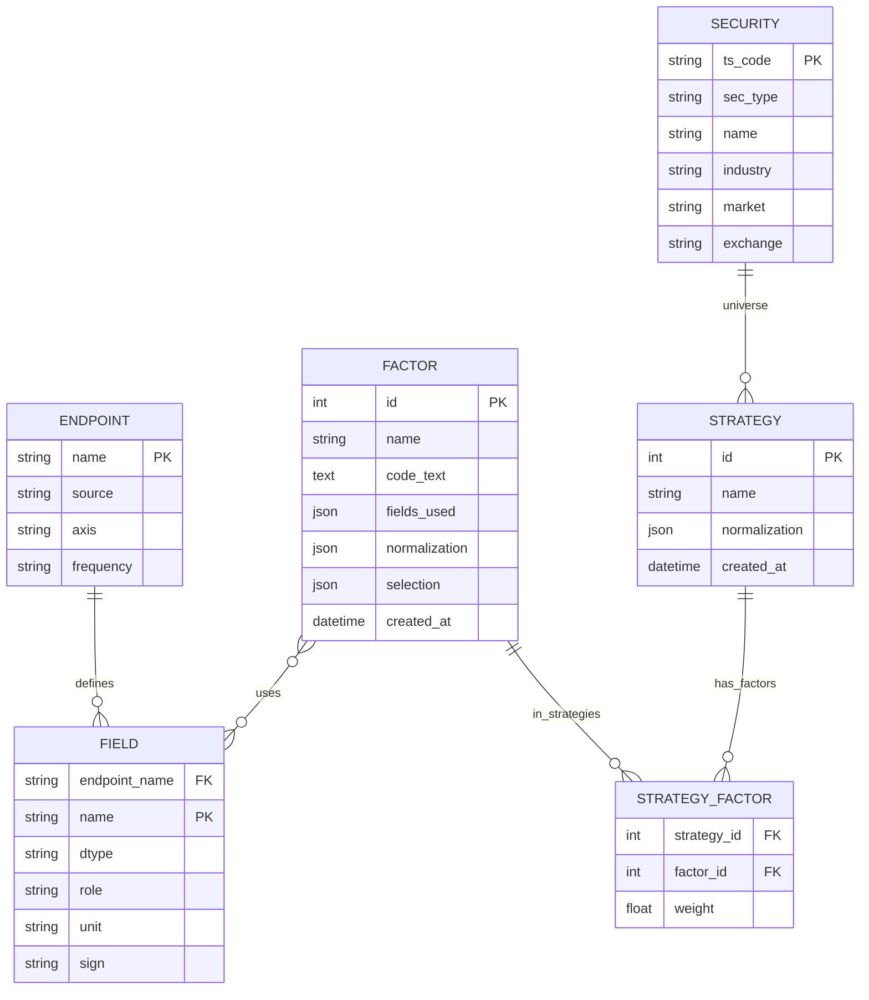

## backend-v2（MVP）需求拆解：最小闭环（cashflow + daily_basic）

### 目标与原则
- **核心目标**: 打通“字段选择 → Coding Agent 生成因子代码 → 快速测试并预览标准化 → 保存因子 → 策略 → 配置因子权重（统一确定标准化与权重归一）→ 执行选股”的最短链路。
- **以数据目录为核心**: 用可版本化 JSON 管理 TuShare 接口与字段元数据（先支持 `cashflow`、`daily_basic`），作为因子开发的“输入宇宙”。
- **安全、简单、可扩展**: 因子代码受限沙箱执行；API 清晰、模块化；后续平滑扩展更多接口与策略能力。

### 用户流程（七步）
1. 选择数据元字段（基于 Catalog 勾选接口与字段）
2. 系统基于第 1 步的 `selections` 自动构建 Agent 上下文，结合用户的因子方案，一并提交给 Coding Agent 生成因子函数代码
3. 快速测试（小样本/时间窗），预览标准化效果
4. 保存因子
5. 新建策略
6. 配置因子权重（在此阶段统一确定标准化策略与权重归一规则，并持久化）
7. 执行策略并返回 Top N 股票

---

## Catalog 存储与抽象（JSON 方案）

### 目录结构（建议）
- `backend-v2/catalog/endpoints/`：每个接口 1 个 JSON（如 `cashflow.json`, `daily_basic.json`）
- `backend-v2/catalog/registry.json`：注册启用的接口文件
- `backend-v2/catalog/selections/`：量化人员为某个因子预选的“选择规范”JSON（每因子 1 个，如 `val-low.json`）

### 接口元数据 JSON Schema（endpoints/*.json）
```json
{
  "name": "cashflow",
  "description": "现金流量表",
  "source": "tushare",
  "sdk": { "method": "cashflow" },
  "axis": "end_date",
  "frequency": "quarterly",
  "ids": ["ts_code"],
  "params": [
    { "name": "ts_code", "type": "string", "required": true, "desc": "股票代码" },
    { "name": "period", "type": "date", "required": false, "desc": "报告期 YYYYMMDD" },
    { "name": "start_date", "type": "date", "required": false, "desc": "公告开始日期" },
    { "name": "end_date", "type": "date", "required": false, "desc": "公告结束日期" },
    { "name": "report_type", "type": "string", "required": false, "desc": "报告类型" },
    { "name": "comp_type", "type": "string", "required": false, "desc": "公司类型 1/2/3/4" },
    { "name": "is_calc", "type": "int", "required": false, "desc": "是否计算报表" }
  ],
  "fields": [
    { "name": "ts_code", "dtype": "string", "role": "identifier", "desc": "TS股票代码" },
    { "name": "end_date", "dtype": "date", "role": "timestamp", "desc": "报告期" },
    { "name": "net_profit", "dtype": "float", "role": "measure", "measure_kind": "flow", "unit": "CNY", "sign": "higher_better" },
    { "name": "n_cashflow_act", "dtype": "float", "role": "measure", "measure_kind": "flow", "unit": "CNY", "sign": "higher_better" }
  ],
  "rate_limit": { "qps": 8, "burst": 16 },
  "examples": { "python": "pro.cashflow(ts_code='600000.SH', period='20181231')" }
}
```

```json
{
  "name": "daily_basic",
  "description": "每日估值/规模/流动性指标",
  "source": "tushare",
  "sdk": { "method": "daily_basic" },
  "axis": "trade_date",
  "frequency": "daily",
  "ids": ["ts_code"],
  "params": [
    { "name": "ts_code", "type": "string", "required": true, "desc": "股票代码（二选一）" },
    { "name": "trade_date", "type": "date", "required": false, "desc": "交易日期（二选一）" },
    { "name": "start_date", "type": "date", "required": false, "desc": "开始日期" },
    { "name": "end_date", "type": "date", "required": false, "desc": "结束日期" }
  ],
  "fields": [
    { "name": "ts_code", "dtype": "string", "role": "identifier", "desc": "TS股票代码" },
    { "name": "trade_date", "dtype": "date", "role": "timestamp", "desc": "交易日期" },
    { "name": "close", "dtype": "float", "role": "measure", "desc": "收盘价", "unit": "CNY", "sign": "ambivalent" },
    { "name": "turnover_rate", "dtype": "float", "role": "measure", "desc": "换手率%", "unit": "%", "sign": "ambivalent", "tags": ["liquidity"] },
    { "name": "volume_ratio", "dtype": "float", "role": "measure", "desc": "量比", "sign": "ambivalent", "tags": ["liquidity"] },
    { "name": "pe", "dtype": "float", "role": "measure", "desc": "PE", "unit": "x", "sign": "lower_better", "tags": ["valuation"] },
    { "name": "pe_ttm", "dtype": "float", "role": "measure", "desc": "PE TTM", "unit": "x", "sign": "lower_better", "tags": ["valuation"] },
    { "name": "pb", "dtype": "float", "role": "measure", "desc": "PB", "unit": "x", "sign": "lower_better", "tags": ["valuation"] },
    { "name": "ps", "dtype": "float", "role": "measure", "desc": "PS", "unit": "x", "sign": "lower_better", "tags": ["valuation"] },
    { "name": "ps_ttm", "dtype": "float", "role": "measure", "desc": "PS TTM", "unit": "x", "sign": "lower_better", "tags": ["valuation"] },
    { "name": "dv_ratio", "dtype": "float", "role": "measure", "desc": "股息率%", "unit": "%", "sign": "higher_better", "tags": ["yield"] },
    { "name": "dv_ttm", "dtype": "float", "role": "measure", "desc": "股息率TTM%", "unit": "%", "sign": "higher_better", "tags": ["yield"] },
    { "name": "total_share", "dtype": "float", "role": "measure", "desc": "总股本(万股)", "unit": "share_10K", "sign": "ambivalent", "tags": ["size"] },
    { "name": "float_share", "dtype": "float", "role": "measure", "desc": "流通股本(万股)", "unit": "share_10K", "sign": "ambivalent", "tags": ["size"] },
    { "name": "free_share", "dtype": "float", "role": "measure", "desc": "自由流通股本(万)", "unit": "share_10K", "sign": "ambivalent", "tags": ["size"] },
    { "name": "total_mv", "dtype": "float", "role": "measure", "desc": "总市值(万元)", "unit": "CNY_10K", "sign": "ambivalent", "tags": ["size"] },
    { "name": "circ_mv", "dtype": "float", "role": "measure", "desc": "流通市值(万元)", "unit": "CNY_10K", "sign": "ambivalent", "tags": ["size"] }
  ],
  "rate_limit": { "qps": 8, "burst": 16 },
  "examples": { "python": "pro.daily_basic(ts_code='600000.SH', trade_date='20180726')" }
}
```

### 注册（registry.json）
```json
{
  "version": "1.0.0",
  "endpoints": [
    { "name": "cashflow", "file": "catalog/endpoints/cashflow.json" },
    { "name": "daily_basic", "file": "catalog/endpoints/daily_basic.json" }
  ]
}
```

### 因子前置“勾选”规范（selections/*.json）
- 用于把“会用到的接口/字段、参数绑定规则、输出索引与标准化约束”固定为一份规范，Coding Agent 与后端共同遵循。

示例：低估值复合（daily_basic）
```json
{
  "factor_slug": "val_low_combo",
  "title": "低估值复合（PE_TTM + PB）",
  "output_index": ["ts_code", "trade_date"],
  "selection": [
    {
      "endpoint": "daily_basic",
      "fields": ["ts_code", "trade_date", "pe_ttm", "pb"],
      "param_binding": {
        "start_date": { "type": "request_arg", "name": "start_date" },
        "end_date": { "type": "request_arg", "name": "end_date" }
      },
      "join_keys": ["ts_code", "trade_date"]
    }
  ],
  "alignment": [],
  "constraints": { "winsor": [0.01, 0.99], "zscore_axis": "trade_date" },
  "code_contract": {
    "signature": "def compute_factor(data: dict[str, pd.DataFrame], params: dict) -> pd.DataFrame",
    "data_keys": ["daily_basic"]
  }
}
```

示例：现金流质量（cashflow）
```json
{
  "factor_slug": "cashflow_quality",
  "title": "现金流质量（经营现金净额/净利润）",
  "output_index": ["ts_code", "end_date"],
  "selection": [
    {
      "endpoint": "cashflow",
      "fields": ["ts_code", "end_date", "n_cashflow_act", "net_profit"],
      "param_binding": {
        "period": { "type": "request_arg", "name": "period" },
        "ts_code": { "type": "request_arg", "name": "ts_codes" }
      },
      "join_keys": ["ts_code", "end_date"]
    }
  ],
  "alignment": [],
  "constraints": { "winsor": [0.01, 0.99], "zscore_axis": "end_date" },
  "code_contract": {
    "signature": "def compute_factor(data: dict[str, pd.DataFrame], params: dict) -> pd.DataFrame",
    "data_keys": ["cashflow"]
  }
}
```

说明：`param_binding` 支持 `fixed`（固定值）、`request_arg`（来自请求）、`derived`（派生规则）。`alignment` 用于跨接口时间轴映射（MVP 可留空）。

### Agent 上下文注入（由选择规范生成）
- 内容：接口描述、入参/字段表（含 dtype/语义标签/单位/方向）、示例 SDK 调用、输出索引要求与清洗/标准化约定、禁用能力与白名单库。
- 用途：由后端构建结构化上下文并注入给 Coding Agent（不对用户暴露/无需复制），确保生成代码满足 `code_contract`。

---

## 支持的接口（MVP）

### cashflow（摘要）
- 文档: `https://tushare.pro/document/2?doc_id=44`
- 主键/对齐字段: `ts_code`, `end_date`
- 入参（关键）：`ts_code`(Y), `period`(N), `start_date`(N), `end_date`(N), `report_type`(N), `comp_type`(N), `is_calc`(N)
- 代表性字段：`net_profit`, `n_cashflow_act`, ...（详见附录 A）

### daily_basic（摘要）
- 文档: `https://tushare.pro/document/2?doc_id=32`
- 主键/对齐字段: `ts_code`, `trade_date`
- 入参（关键）：`ts_code`(Y, 与 `trade_date` 二选一), `trade_date`(N), `start_date`(N), `end_date`(N)
- 代表性字段：`close`, `turnover_rate`, `pe`, `pe_ttm`, `pb`, `ps`, `ps_ttm`, `dv_ratio`, `dv_ttm`, `total_mv`, `circ_mv`, ...

---

## 新增：Universe 数据源与执行筛选（stock_basic）

### 数据源
- 使用 TuShare `stock_basic` 作为股票列表的权威来源（较少变动，建议定期同步并落地存储）
- 关键字段：`ts_code`, `symbol`, `name`, `area`, `industry`, `market`, `exchange`, `list_status`, `list_date`, `delist_date`, `is_hs` 等
- 可扩展到 ETF、指数等证券（通过 `sec_type` 拓展：`stock`/`etf`/...）

### 存储与同步
- 持久化：SQLite 表 `securities`
  - 列：`sec_type`(stock/etf)、`ts_code` PK、`symbol`、`name`、`area`、`industry`、`market`、`exchange`、`list_status`、`list_date`、`delist_date`、`is_hs`、`updated_at`
- 同步 API（手动触发）：
  - `POST /universe/sync` → 拉取 `stock_basic`（及后续扩展的 ETF）并刷新 `securities`
- 查询 API：
  - `GET /universe/stocks` → 支持筛选参数：`industry`、`market`、`list_status`、`exchange`、`is_hs`、`q`(名称/代码模糊)
  - `GET /universe/stocks/{ts_code}`

### 策略执行中的 Universe 过滤
- 在 `POST /strategies/{id}/run` 中新增过滤参数：
  - `industry`（按行业筛选）
  - `ts_codes`（指定股票列表）
  - 或 `all=true`（全量股票）
- 优先级：`ts_codes` > `industry` > `all`
- 最终在 universe 基础集上运行策略（默认使用策略持久化的标准化配置与权重）

---

## API 设计（MVP）

### 健康
- GET `/health` → { status, version }

### Catalog（接口与字段元数据）
- GET `/catalog/endpoints` → 列举可用接口（来自 `registry.json`）
- GET `/catalog/endpoints/{name}` → 返回接口元数据（来自 `endpoints/{name}.json`）
- GET `/catalog/fields/search?q=keyword` → 跨字段检索（返回字段名、所属接口、描述）

### Selections（因子前置勾选）
- POST `/catalog/selections` → 新建选择规范（body 为 selections JSON）
- PUT `/catalog/selections/{slug}` → 更新规范
- GET `/catalog/selections` → 列表
- GET `/catalog/selections/{slug}` → 获取规范

备注（MVP）：本期不引入 `selection` 的版本号与变更注释。

### 因子
- POST `/factors/codegen` → 基于 `selection_slug`/`selection` 与 `user_factor_spec` 构建上下文并调用 Coding Agent，返回 `code_text`、`fields_used`、`notes?`
- POST `/factors/validate` → 语法/安全/依赖/字段越界校验（可附 `required_fields`）
- POST `/factors/test` → 基于 selections 拉数并执行因子代码（可选标准化预览），返回样例数据与诊断统计。测试规模限制（MVP）：股票数 3–10 支。
- POST `/factors` → 保存因子（name/desc/code/fields_used/normalization/selection）
- GET `/factors`、GET `/factors/{id}`

### 标准化
- POST `/standardize/zscore` → 横截面逐期 Z-Score（winsor/填充策略可配）

### 策略
 - POST `/strategies` → 创建（可含 `normalization` 策略与 `universe` 过滤）
 - PUT `/strategies/{id}/weights` → 更新权重（接收原始权重，服务端按策略归一规则自动规范化并持久化；本请求可同时携带 `normalization`，实现“在关联阶段统一确定权重与标准化策略”）
 - PUT `/strategies/{id}/normalization` → 更新策略级标准化策略（可选；通常随权重一起设置）
 - POST `/strategies/{id}/run` → 执行并返回 Top N（支持 `industry`/`ts_codes`/`all` 的 universe 过滤；默认按持久化标准化与权重归一执行；可传 `normalization_override` 临时覆盖）
 - GET `/strategies/{id}`

### Universe（新增）
- POST `/universe/sync` → 同步 `stock_basic`（未来可扩展 ETF 等）
- GET `/universe/stocks` → 支持筛选参数 `industry`、`market`、`list_status`、`exchange`、`is_hs`、`q`
- GET `/universe/stocks/{ts_code}`

---

## 数据拉取与缓存
- 客户端：`tushare_client.fetch(endpoint, params)`（多 `ts_code` 迭代合并）
- 限流：简单 QPS 控制；支持 `rate_limit` 覆盖
- 缓存：本地磁盘（parquet/sqlite），键 = endpoint + 参数哈希；默认 TTL 24h（本期默认值）
- 参数绑定：按 selections 的 `param_binding` 将请求/固定/派生参数拼装

---

## 因子函数与执行契约
- 签名：`def compute_factor(data: dict[str, pd.DataFrame], params: dict) -> pd.Series | pd.DataFrame`
- 输入：`data` 的键与列由 selections 决定；输出按 `output_index` 对齐
- 标准化：默认支持横截面 Z-Score；winsor 缺省 [1%, 99%]，缺失按期中位数
- 可用库：numpy、pandas（受限），禁用 I/O/网络/子进程/反射/动态导入

## 因子标准化（多因子统一）

### 何时标准化
- 在“策略与因子关联（配权）阶段”统一确定并持久化：标准化策略与权重归一规则；从而锁定后续运行的一致性。
- 实际计算在“策略执行”阶段按上述策略逐期横截面进行，保证不同因子在同一时间、同一股票池（universe）内可比。
- 单因子测试阶段仅用于“预览标准化效果”（使用策略级参数），不落库标准化后的值；保存因子时持久化的是“原始因子代码 + 默认标准化建议”。

### 策略级标准化流水线（每期横截面）
1. 确定当期股票池（universe）：来自策略、universe 过滤参数或本次运行请求。
2. 取各因子当期原始值，并按因子方向做一致化（例如字段/因子标记为 `lower_better` 则取相反数，使得“越高越好”）。
3. Winsor 去极值：按分位数 `[q_low, q_high]` 截断。
4. 缺失处理：按期内中位数填充（可配置 `zero`/`drop`）。
5. 标准化：
   - `zscore`：`(x - mean) / std`（或 `mad` 作为更稳健的尺度）。
   - `robust_zscore`：`(x - median) / mad`。
   - `rank`：转为分位秩（0-1）。
   - `minmax`：缩放至 [0,1]。
6. 组合：按策略权重对标准化后的各因子求加权和，得到当期综合得分并排序。权重在“关联阶段”已按归一规则规范化（默认 L1：∑|w|=1，可配置）。

### 标准化配置（NormalizationPolicy）
策略级默认配置（可被运行时覆盖）：

```json
{
  "method": "zscore",
  "winsor": [0.01, 0.99],
  "fill": "median",
  "demean": true,
  "scale": "std",
  "by": ["date"],
  "sign_policy": "higher_is_better"
}
```

- **method**: `zscore` | `robust_zscore` | `rank` | `minmax`。
- **winsor**: 去极值分位数区间。
- **fill**: 缺失值策略，默认期内中位数。
- **demean/scale**: 去均值与尺度（`std` 或 `mad`）。
- **by**: 横截面分组轴，MVP 按单一时间轴（如 `trade_date` 或 `end_date`）。
- **sign_policy**: 将所有因子转化为“越高越好”的一致方向。

注意：跨接口时间轴对齐（如 `cashflow.end_date` → 交易日）仍遵循 selections 的对齐规则（MVP 可简化或留空）。

### 预览标准化效果（测试阶段）

- 含义：在小样本/短时间窗/指定股票池上，临时按某个标准化配置对当前因子值做一次完整流水线计算，仅用于观测与调参，不写库、不影响策略。
- 做了什么：方向一致化 → winsor 去极值 → 缺失填充 → 标准化（zscore/robust_zscore/rank/minmax）。
- 你能看到的结果（诊断）：
  - 逐期横截面统计：均值、标准差（zscore 情形≈0/1）、偏度、峰度
  - 去极值比例：低/高端裁剪占比、被裁剪样本清单
  - 缺失与填充：缺失率、填充值（如期内中位数）
  - 分布形态：直方图/箱线图/QQ（聚合或逐期）
  - 稳定性：逐期均值/标准差的时间序列漂移
  - 方向检查：`lower_better` 是否已正确反转为“越高越好”
  - 极端样本：每期 Top/Bottom N 证券列表
- 不做什么：不持久化标准化后的因子值；不确定最终标准化策略或权重（这些在第 6 步与策略关联时一次性定稿）。
- 与第 6 步的关系：第 3 步用“临时配置”做可视化与对比，帮助选择 winsor/标准化方法/方向处理；第 6 步在配置权重时，统一确定并落库“策略级标准化配置 + 权重归一规则”。

---

## 安全与合规
- 静态检查：AST 黑/白名单
- 运行沙箱：仅暴露安全模块与函数
- 资源限制：超时/内存阈值；掩码敏感信息（token）

---

## 配置与部署
- 环境变量：`TUSHARE_TOKEN`, `CACHE_TTL_HOURS`, `MAX_QPS`, `LOG_LEVEL`, `API_HOST`, `API_PORT`
- 启动：`uvicorn` 单进程；可选 `Dockerfile`

---

## 持久化（SQLite，简化）
- `factors`：id, name, desc?, code_text, fields_used(json), normalization(json), tags(json), selection(json), created_at
- `strategies`：id, name, normalization(json), created_at
- `strategy_factors`：strategy_id, factor_id, weight  （已归一化后存储；默认 L1）
- `securities`：sec_type, ts_code, symbol, name, area, industry, market, exchange, list_status, list_date, delist_date, is_hs, updated_at
- （可选）`test_runs`：id, factor_id?, request(json), stats(json), sample_rows(json), created_at

## 数据模型关系（ER 图）



---

## 验收
- 能从 Catalog 选择接口与字段，生成 selections JSON
- 系统基于 selections 构建 Agent 上下文并产出可运行的因子代码
- 指定股票池与时间窗测试，预览标准化效果并得到统计
- 保存因子，创建策略，在关联阶段确定标准化策略与权重归一并执行，得到 Top N 股票
- Universe：能同步 `stock_basic` 并落地；能按行业/自定义股票列表/全量三种方式选择执行范围

---

## 开放问题（待确认）
- 主时间轴：`cashflow` 用 `end_date`，`daily_basic` 用 `trade_date`。跨接口对齐策略（近邻/传播窗口）本期暂不实现，但在文档中记录以便后续扩展。
- Z-Score 默认：本期默认 `zscore`，winsor 默认 [1%, 99%]，缺失按期中位数填充；均在策略级可配置。
- 缓存 TTL：默认 24h（本期默认值）。
- Selections CRUD：本期不引入版本号与变更注释。
- `param_binding` 规则是否需要内置通用派生（如 `period` ↔ 季度范围）？（后续评估）
- 单次测试限制：股票数 3–10 支；期次上限按实现约束设定（建议 ≤ 8）。
- `daily`（行情 K 线）接口：下一期再引入，先跑通基于基本面数据的多因子策略。

---

## 附录 A：cashflow 字段清单（节选）
- 入参: ts_code, ann_date, f_ann_date, start_date, end_date, period, report_type, comp_type, is_calc
- 输出字段（节选）：`ts_code`, `ann_date`, `f_ann_date`, `end_date`, `comp_type`, `report_type`, `end_type`, `net_profit`, `finan_exp`, `c_fr_sale_sg`, `c_inf_fr_operate_a`, `st_cash_out_act`, `n_cashflow_act`, `stot_inflows_inv_act`, `n_cashflow_inv_act`, `stot_cash_in_fnc_act`, `free_cashflow`, `n_cash_flows_fnc_act`, `n_incr_cash_cash_equ`, `c_cash_equ_end_period`, `update_flag`, ...

## 附录 B：daily_basic 字段清单（节选）
- 入参: ts_code, trade_date, start_date, end_date
- 输出字段（节选）：`ts_code`, `trade_date`, `close`, `turnover_rate`, `turnover_rate_f`, `volume_ratio`, `pe`, `pe_ttm`, `pb`, `ps`, `ps_ttm`, `dv_ratio`, `dv_ttm`, `total_share`, `float_share`, `free_share`, `total_mv`, `circ_mv`
